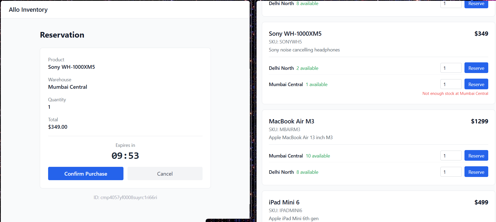

# Inventory Reservation System

Hey! This is my submission for the Allo Engineering take-home exercise. It's an inventory reservation system built with Next.js App Router and Prisma. 

I focused mainly on getting the database concurrency right (the race condition part) since that seemed like the core requirement of the assignment.

## Tech Stack
* **Next.js 14** (App Router)
* **TypeScript** (typed end-to-end)
* **Prisma ORM**
* **PostgreSQL** (hosted on Neon.tech)
* **Tailwind CSS** (kept the UI pretty minimal)

## How to run it locally

1. Clone the repo and install dependencies:
   ```bash
   npm install
   ```
2. Set up your `.env` file (you can copy `.env.example`). You'll need a Neon Postgres database.
   ```env
   DATABASE_URL="your-neon-pooler-url"
   DIRECT_URL="your-neon-direct-url"
   CRON_SECRET="make-up-a-random-string"
   ```
3. Push the schema and seed the database with some initial products/warehouses:
   ```bash
   npx prisma db push
   npx ts-node -P tsconfig.seed.json prisma/seed.ts
   ```
4. Start the server:
   ```bash
   npm run dev
   ```

## How to test the Concurrency / Race Condition

The main challenge was preventing two people from buying the exact same physical unit. 

To make this easy to test, the seed script puts exactly **1 unit** of the "Sony WH-1000XM5" in the "Mumbai Central" warehouse. 
If you open two browser tabs and try to click "Reserve" on both at the exact same time, one will succeed and go to the checkout page, and the other will get an "Out of stock" error (409 Conflict).



**How it works under the hood:** 
I used pessimistic row-level locking. Inside a Prisma `$transaction`, I run a raw `SELECT ... FOR UPDATE` query on the `StockLevel` table. This locks that specific row in Postgres. If a second checkout request comes in for the same product at the same time, it has to wait until the first transaction finishes.

## Expiry Mechanism

For the 10-minute reservation expiry, I went with a **Vercel Cron job**. 
It's configured in `vercel.json` to hit `/api/cron/expire-reservations` every single minute. The endpoint finds all `PENDING` reservations where `expiresAt` is in the past, marks them as `RELEASED`, and adds the units back to the available pool. 

To keep it secure in production, the endpoint requires a `CRON_SECRET` header that matches the environment variable.

## Trade-offs & Notes

* **Idempotency Bonus:** I skipped the optional `Idempotency-Key` bonus to focus on the core requirements. If I had more time, I'd probably make a new DB table to cache responses keyed by the idempotency token, so repeated requests just return the cached response.
* **UI Polish:** The frontend gets the job done but it's pretty basic. I didn't use shadcn or anything, just plain Tailwind. 
* **Cron Delay:** Because the Vercel cron job runs every 60 seconds, an expired reservation might keep stock tied up for up to a minute longer than it should. A queue/worker system like Inngest or Redis would be more accurate, but Vercel Cron is way simpler for a prototype.

